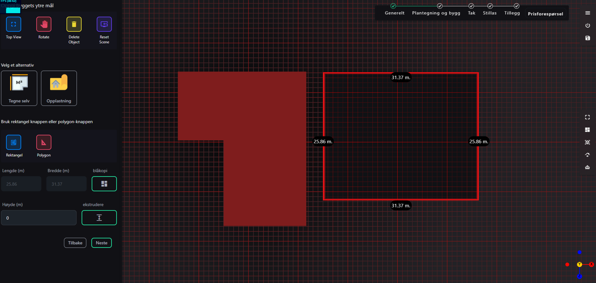
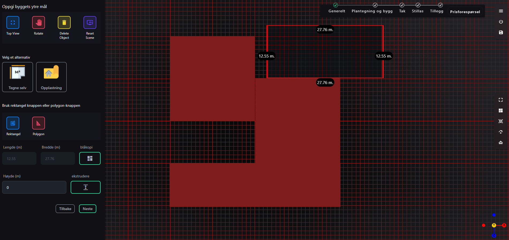
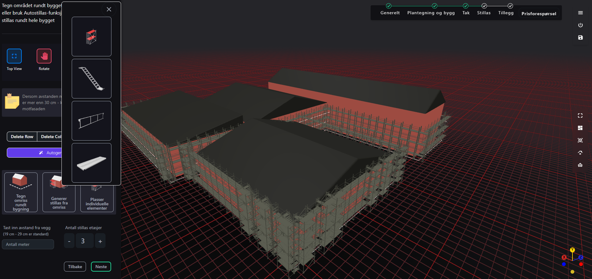
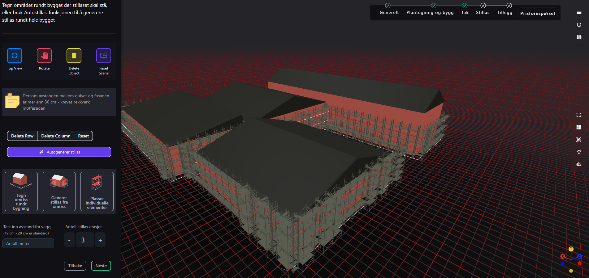
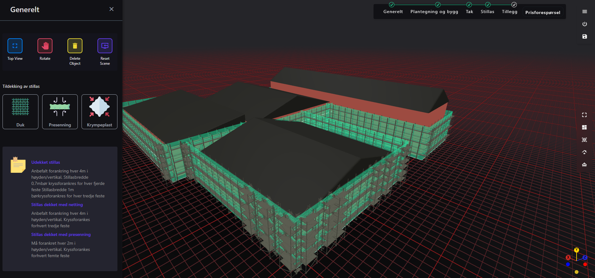
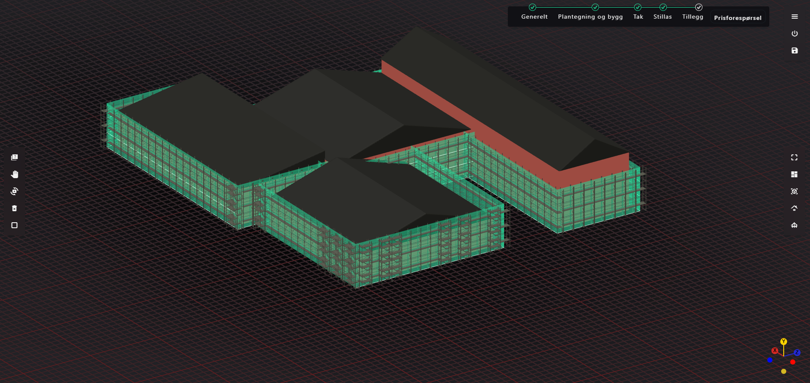

# Overview of 3D Scaffolding 

*give this repo a star if you found it useful*












**demo**: https://stiller-scaffold-bim-two.vercel.app/model
**note:** this demo was created for a Norwegian company so much of the functionality has been labeled in Norwegian.

The envisioned scaffolding graphics application is designed to:
1. **Allow users to define and modify building structures** by drawing measurements and extruding cubes or rectangles.
2. **Enable height adjustments and roof generation** through user-friendly UI controls.
3. **Provide automated scaffolding generation** based on selected building areas, with customization options for scaffold components.
4. **Generate a comprehensive Bill of Materials (BOM)** by quantifying scaffold elements.
5. **Offer an interactive, real-time editing environment** for scaffold manipulation and visualization.

To achieve these goals, the application leverages cutting-edge web technologies to ensure high performance, scalability, and seamless user interaction.

## Technical Implementation

### Rendering Pipeline with WebGPU
**WebGPU** serves as the rendering backend, offering unparalleled performance for real-time 3D graphics. Key benefits include:
- **Instanced Mesh Rendering**: Use instanced rendering to draw thousands of scaffold elements efficiently.
- **Parallel Processing**: Leverage GPU compute shaders for geometry updates, lighting calculations, and physics simulations.
- **Memory Management**: Optimize GPU memory usage by batching scaffold components and reducing draw calls.

#### Optimizations:
- **Frustum Culling**: Only render scaffolding and buildings visible in the viewport.
- **Level of Detail (LOD)**: Dynamically adjust the detail of scaffolds based on the camera distance.
- **Dynamic Updates**: Use buffer updates for real-time scaffold transformations without reloading meshes.

### Integrating `ifc.js` for BIM Models
The application uses the **`ifc.js`** library to render Building Information Modeling (BIM) files:
- **WebAssembly (WASM) Backend**: Delivers high-performance parsing and rendering of IFC files directly in the browser.
- **Component Extraction**: Extracts specific building components, such as walls or roofs, to define scaffold attachment points.
- **Custom Materials**: Allows dynamic material assignment to differentiate scaffolding from building structures.

## Detailed Features

### Defining and Modifying Building Structures
Users can draw and define the dimensions of buildings using an intuitive interface. The application supports:
- **Measurement Tools**: Users can input precise measurements to define the width, height, and depth of structures.
- **Extrusion**: Convert 2D shapes into 3D structures by extruding rectangles and cubes.

### Height Adjustments and Roof Generation
The application includes user-friendly controls to adjust the height of buildings and generate roofs:
- **Slider Controls**: Allow users to adjust building heights dynamically.
- **Roof Generation**: Automatic generation of roofs based on the building's perimeter, with options for different roof styles.

### Automated Scaffolding Generation
Scaffolding is generated automatically based on the building's dimensions and user specifications:
- **Selection Tools**: Users can select areas of the building for scaffolding.
- **Customization Options**: Users can customize scaffold components, including material types and dimensions.

### Generating a Bill of Materials (BOM)
A comprehensive BOM is generated to quantify all scaffold elements:
- **Quantification**: The application counts and lists all scaffold components used.
- **Export Options**: Users can export the BOM in various formats (e.g., CSV, PDF).

### Interactive, Real-Time Editing Environment
The application provides a real-time editing environment for scaffold manipulation:
- **Drag-and-Drop Interface**: Users can move and adjust scaffold components interactively.
- **Real-Time Updates**: Changes are reflected immediately, ensuring an accurate representation of the scaffolding.

# Scaffolding BIM tool

scaffolding / BIM tool

there is a conflict between the version of the three package required by your project (three@0.160.1) and the version required by the openbim-components package (three@0.152.2).

downgrading a package might affect other parts of your project that rely on features or fixes introduced in later versions of the package. Make sure to thoroughly test your project after making this change.

# Shapes

Most build tools are based on the concept of blueprints with rectangular shapes.This is because most commercial designs are rectangular, or square, is because they are easier, faster and more economical to build out of ordinary materials – stone, concrete, brick or wood. Square and rectangular shapes are also exponentially easier to reconcile, and there's usually less waste.

### Install dependencies

```
npm install
```

### Run Development

```
npm run dev
```

# Additional Information

'''
git ls-files | grep -vE 'package.json|package-lock.json|tsconfig.json|tsconfig.node.json|vite.config.ts|tailwind.config.js|.*\.glb|.*\.ifc' | xargs wc -l
'''

11542 total - 8/12/2024
